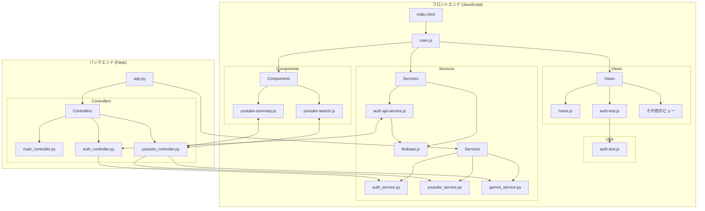
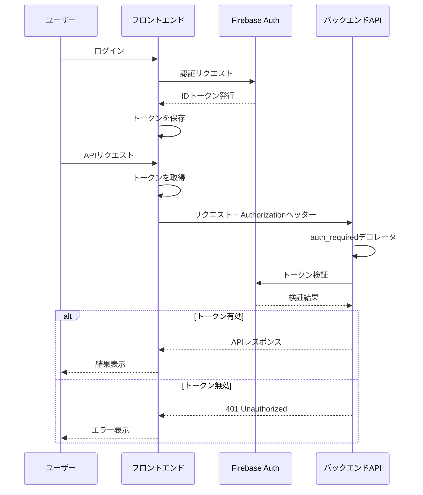
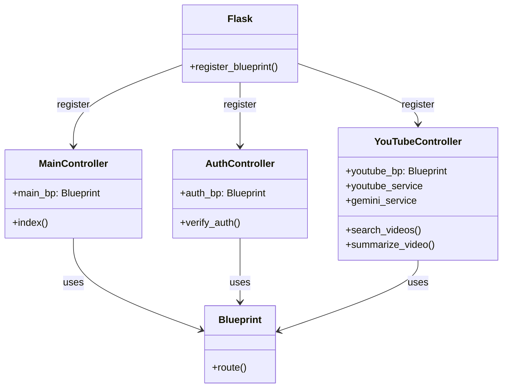
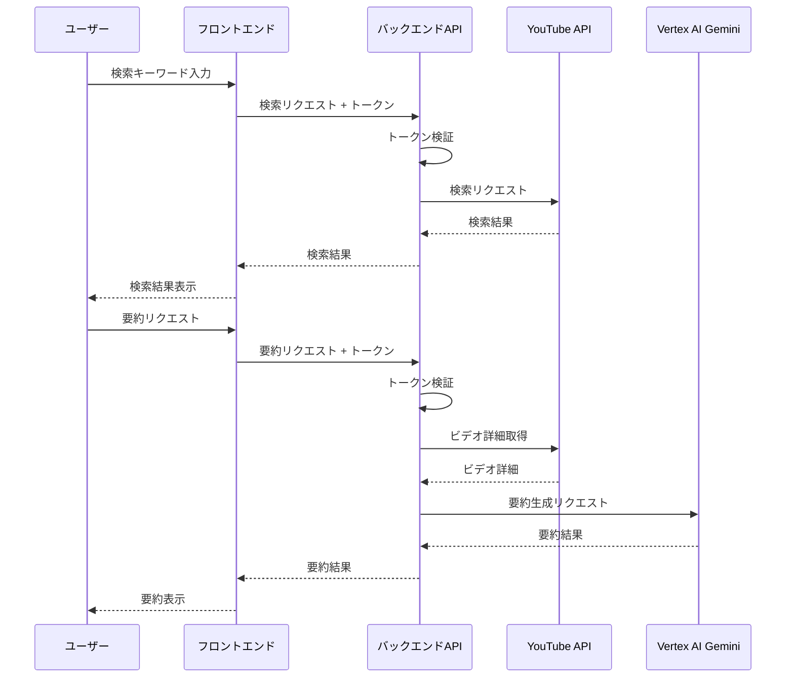
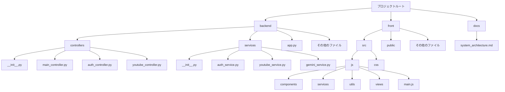

# システムアーキテクチャ

このドキュメントでは、YouTubeビデオ検索・要約アプリケーションのシステムアーキテクチャを説明します。

## システム全体構成

## 認証フロー

## バックエンドコントローラー構造

## YouTube検索・要約フロー

## ディレクトリ構造

## 技術スタック

- **フロントエンド**:
  - HTML/CSS/JavaScript
  - Bootstrap (スタイリング)
  - Vite (ビルドツール)
  - Firebase Authentication (認証)

- **バックエンド**:
  - Python
  - Flask (Webフレームワーク)
  - Blueprint (モジュール化)
  - Firebase Admin SDK (認証検証)
  - YouTube Data API (ビデオ検索)
  - Vertex AI Gemini (AI要約生成)
